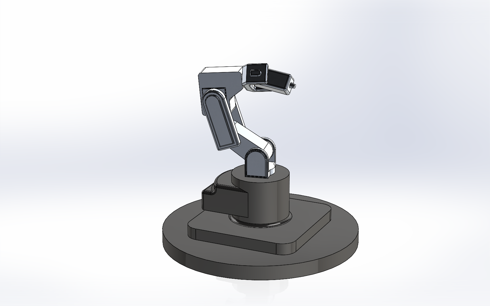

# Robotic Arm - Simulation and Control

This is the GitHub Repository for the gesture-controlled 6 DOF Robotic Arm Simulation.

## Structure
The project structure is as follows
```

```

## Description
Originally, a 3D model was created in [SOLIDWORKS](https://www.solidworks.com/). The model was based on the [Mecademic MECA-500](https://www.mecademic.com/meca500-industrial-robot-arm/), the most precise industrial robotic manipulator.  The image of the 3D model created in SOLIDWORKS is shown below:

<p align="center">
    
</p>
<p align="center">
    3D Model Designed in SOLIDWORKS
</p>

The model was then converted into a URDF (Unified Robotic Description Format) using [SOLIDWORKS to URDF Exporter](http://wiki.ros.org/sw_urdf_exporter), by specifying the links, joints, and limits. This URDF file is stored [here](/six_dof_arm/urdf/six_dof_arm.urdf) in the six_dof_arm package.


## Dependencies and Installation


## License
The project is licensed under the Apache 2.0 license - see [LICENSE](/LICENSE) for more details.